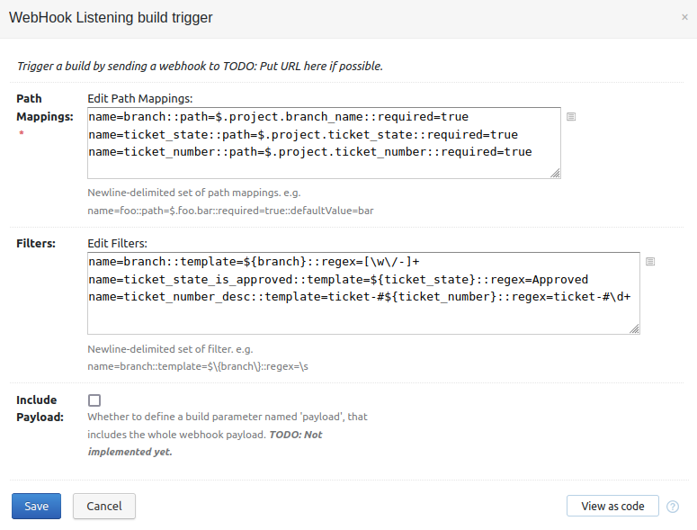

# tcWebHookTrigger - A TeamCity plugin for generic webhooks to trigger builds

tcWebHookTrigger is a TeamCity Build Trigger plugin for receiving webhook requests
and using the information from them to trigger a build. 

It presents a URL on the TeamCity server that when POST'd to will attempt to read 
the payload and extract pre-configured variables.

The first version supports payloads in the JSON format. It uses 
[JSON Path](https://github.com/json-path/JsonPath) to parse the json payload looking for 
values. Those values are then converted to TeamCity Build Parameters, and used to customise 
the build when it is triggered.

Example webhook payload.
```javascript
{ 
  "project" : {
    "name" : "foo",
    "branch_name" : "bugfix/12345-fix-indenting",
    "ticket_number" : "12345",
    "ticket_title" : "Fix indenting on Application.java source code",
    "ticket_state" : "Approved"
  }
}
```

Suppose you received a webhook with the above payload contained within it. When this payload 
is sent to teamcity, the build should run against the `bugfix/12345-fix-indenting` branch 
if the `ticket_state` is "Approved".

As part of the build, we'd also like to log ticket number in the format `ticket_#12345`

Using JSON-Path, we can extract values from the json payload using the json-path syntax.

#### Example Trigger configuration



##### Path Mappings
Path Mappings are defined one per line with key/value pairs separated by double colon `::`
`name=branch::path=$.project.branch_name::required=true`
There are four keys for which values can be assigned.

| Key  | Value | Is required |
| -----| ----- | ----------- |
| name | Specifies the name of the variable to be defined. | Yes |
| path | The json-path specification determining how to find the value in the webhook payload | Yes |
| required | Determines if the path must be found in the document. If required, and not found, the build will not be triggered | No |
| defaultValue | A default value to use if the path is not found | No |

##### Filters (optional)
Filters are define one per line with key/value pairs seperated by double colon `::`
`name=branch::template=${branch}::regex=[\w\/-]+`
There are three key for which values can be assigned.

| Key  | Value | Is required |
| -----| ----- | ----------- |
| name | Specifies the name of the variable to be defined. | Yes | 
| template | Allows creating a string made up of text and path mappings | Yes
| regex | Specifies the regular expression to use to validate the rendered template matches. If the regex does not match, the build will not be triggered | Yes |


##### The "branch" keyword

A path mapping or a filter named `branch` has a special meaning. If this is found, then the build will be triggered against that branch. If the branch is not value, behaviour is undefined.

##### Putting it all together

For the above example payload and example configuration, the build would be triggered in the following way.
1. The value found at `$.project.branch_name` would be assigned to the variable `branch`. It is required, so the value must be present in the payload.
1. The value found at `$.project.ticket_state` would be assigned to the variable `ticket_state`. It is required, so the value must be present in the payload.
1. The value found at `$.project.ticket_number` would be assigned to the variable `ticket_number`. It is required, so the value must be present in the payload.
1. A new filter variable will be created called `branch` from the value of the variable called `branch`. This value is then validated against the regular expression `[\w\/-]+`.
1. A new filter variable will be created called `ticket_state_is_approved` from the variable called `ticket_state`. This value is validated against the regular expression `Approved`.
1. A new filter variable will be created called `ticket_number_desc` from the template `ticket-#${ticket_number}`. This value is validated against the regular expression `ticket-#\d+`. It will result in a variable called `ticket_number_desc` containing the value `ticket-#12345`.
1. The following build parameters will be defined and passed to the build.

| Name | Value |
| ---- | ----- |
| branch | bugfix/12345-fix-indenting |
| ticket_state | Approved |
| ticket_number | 12345 |
| ticket_state_is_approved | Approved |
| ticket_number_desc | ticket-#12345 |

