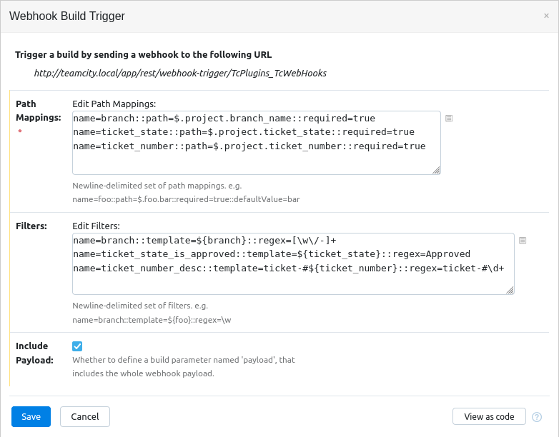

# tcWebHookTrigger - A TeamCity plugin for generic webhooks to trigger builds

tcWebHookTrigger is a TeamCity Build Trigger plugin for receiving webhook requests
and using the information from them to trigger a build. 

It presents a URL on the TeamCity server that when POST'd to will attempt to read 
the payload and extract pre-configured variables.

WebHook events can be sent from another system to TeamCity using this plugin. For the 
rest of this document the system sending webhooks to TeamCity will be referred to as the `WebHook Sender`.

The first version supports payloads in the JSON format. It uses 
[JSON Path](https://github.com/json-path/JsonPath) to parse the json payload looking for 
values. Those values are then converted to TeamCity Build Parameters, and used to customise 
the build when it is triggered.

Example webhook payload.
```javascript
{ 
  "project" : {
    "name" : "foo",
    "branch_name" : "bugfix/12345-fix-indenting",
    "ticket_number" : "12345",
    "ticket_title" : "Fix indenting on Application.java source code",
    "ticket_state" : "Approved"
  }
}
```

Suppose you received a webhook from a WebHook Sender with the above payload contained within it. When this payload 
is sent to teamcity, the build should run against the `bugfix/12345-fix-indenting` branch 
if the `ticket_state` is "Approved".

As part of the build, we'd also like to log ticket number in the format `ticket-#12345`

Using JSON-Path, we can extract values from the json payload using the json-path syntax.

#### Example Trigger configuration



##### Path Mappings
Path Mappings are defined one per line with key/value pairs separated by double colon `::`
`name=branch::path=$.project.branch_name::required=true`
There are four keys for which values can be assigned.

| Key  | Value | Is required |
| -----| ----- | ----------- |
| name | Specifies the name of the variable to be defined. | Yes |
| path | The json-path specification determining how to find the value in the webhook payload | Yes |
| required | Determines if the path must be found in the document. If required, and not found, the build will not be triggered | No |
| defaultValue | A default value to use if the path is not found | No |

##### Filters (optional)
Filters are define one per line with key/value pairs seperated by double colon `::`
`name=branch::template=${branch}::regex=[\w\/-]+`
There are three key for which values can be assigned.

| Key  | Value | Is required |
| -----| ----- | ----------- |
| name | Specifies the name of the variable to be defined. | Yes | 
| template | Allows creating a string made up of text and path mappings | Yes
| regex | Specifies the regular expression to use to validate the rendered template matches. If the regex does not match, the build will not be triggered | Yes |


##### The "branch" keyword

A path mapping or a filter named `branch` has a special meaning. If this is found, then the build will be triggered against that branch. If the branch is not value, behaviour is undefined.

##### Putting it all together

For the above example payload and example configuration, the build would be triggered in the following way.
1. The value found at `$.project.branch_name` would be assigned to the variable `branch`. It is required, so the value must be present in the payload.
1. The value found at `$.project.ticket_state` would be assigned to the variable `ticket_state`. It is required, so the value must be present in the payload.
1. The value found at `$.project.ticket_number` would be assigned to the variable `ticket_number`. It is required, so the value must be present in the payload.
1. A new filter variable will be created called `branch` from the value of the variable called `branch`. This value is then validated against the regular expression `[\w\/-]+`.
1. A new filter variable will be created called `ticket_state_is_approved` from the variable called `ticket_state`. This value is validated against the regular expression `Approved`.
1. A new filter variable will be created called `ticket_number_desc` from the template `ticket-#${ticket_number}`. This value is validated against the regular expression `ticket-#\d+`. It will result in a variable called `ticket_number_desc` containing the value `ticket-#12345`.
1. The following build parameters will be defined and passed to the build.

| Name | Value |
| ---- | ----- |
| branch | bugfix/12345-fix-indenting |
| ticket_state | Approved |
| ticket_number | 12345 |
| ticket_state_is_approved | Approved |
| ticket_number_desc | ticket-#12345 |


##### Installing the plugin

- Download the plugin zip file from [releases here on github](https://github.com/tcplugins/tcWebHookTrigger/releases). 
- Install the plugin into TeamCity as [described in the docuementation](https://www.jetbrains.com/help/teamcity/installing-additional-plugins.html#Installing+a+plugin+via+Web+UI)

##### Adding the WebHook Trigger to a build
In TeamCity, triggers are configured on a build configuration. 

1. Navigate to the configuration page in TeamCity and select the `Triggers` tab.
1. Click `+ Add new trigger` and choose `WebHook Listening build trigger` from the bottom of the list.
1. Configure the trigger settings. See the above screenshot for an example configuration.
1. Click Save, and the settings will be validated and saved.
1. Go to the `General Settings` tab and note the `Build Configuration ID`. This will be part of the URL for the webhook endpoint.

##### Triggering a build with a webhook

The WebHook Trigger endpoint is installed in TeamCity by this plugin. The location is <i><teamcity_root_url></i>/app/webhook-trigger/<i>BuildConfigId</i>.
This endpoint is authenticated by TeamCity so the easiest way to allow the WebHook Sender to authenticate is to prepend `/httpAuth` to the URL and send basic authentication credentials. Then the webhook trigger URL becomes <i><teamcity_root_url></i>/httpAuth/app/webhook-trigger/<i>BuildConfigId</i>

See also issue #5 for progress on bearer authentication. 

###### Example logging

```
[2021-09-29 10:50:03,102]  DEBUG - tbrains.buildServer.ACTIVITIES - tcWebHookTrigger-BuildTriggerResolverService: Found matching SBuildType. buildType='TcPlugins_TcWebHooksOnQuimby'
[2021-09-29 10:50:03,102]  DEBUG - tbrains.buildServer.ACTIVITIES - tcWebHookTrigger-BuildTriggerHandlerService: Starting Webhook Trigger processing. buildType='TcPlugins_TcWebHooksOnQuimby', triggerName='webhookBuildTrigger', triggerId='TRIGGER_6'
[2021-09-29 10:50:03,103]  DEBUG - tbrains.buildServer.ACTIVITIES - tcWebHookTrigger-BuildTriggerHandlerService: Webhook Payload content: 
{   "project" : {    "name" : "foo",    "branch_name" : "bugfix/12345-fix-indenting",    "ticket_number" : "12345",    "ticket_title" : "Fix indenting on Application.java source code",    "ticket_state" : "Approved"  }}
[2021-09-29 10:50:03,103]  DEBUG - tbrains.buildServer.ACTIVITIES - tcWebHookTrigger-BuildTriggerHandlerService: Parameter is resolved. Parameter will be passed to the build. name='branch', value='bugfix/12345-fix-indenting'
[2021-09-29 10:50:03,103]  DEBUG - tbrains.buildServer.ACTIVITIES - tcWebHookTrigger-BuildTriggerHandlerService: Parameter is resolved. Parameter will be passed to the build. name='ticket_state', value='Approved'
[2021-09-29 10:50:03,103]  DEBUG - tbrains.buildServer.ACTIVITIES - tcWebHookTrigger-BuildTriggerHandlerService: Parameter is resolved. Parameter will be passed to the build. name='ticket_number', value='12345'
[2021-09-29 10:50:03,103]  DEBUG - tbrains.buildServer.ACTIVITIES - tcWebHookTrigger-BuildTriggerHandlerService: Regex match found. name='branch', regex='[\w\/-]+', value='bugfix/12345-fix-indenting'
[2021-09-29 10:50:03,103]  DEBUG - tbrains.buildServer.ACTIVITIES - tcWebHookTrigger-BuildTriggerHandlerService: Regex match found. name='ticket_state_is_approved', regex='Approved', value='Approved'
[2021-09-29 10:50:03,103]  DEBUG - tbrains.buildServer.ACTIVITIES - tcWebHookTrigger-BuildTriggerHandlerService: Regex match found. name='ticket_number_desc', regex='ticket-#\d+', value='ticket-#12345'
[2021-09-29 10:50:03,103]  DEBUG - tbrains.buildServer.ACTIVITIES - tcWebHookTrigger-BuildTriggerHandlerService: Found filter named 'branch'. Build will be requested against branch 'bugfix/12345-fix-indenting'. buildType='TcPlugins_TcWebHooksOnQuimby', triggerName='webhookBuildTrigger', branchName='bugfix/12345-fix-indenting', triggerId='TRIGGER_6'
[2021-09-29 10:50:03,107]   INFO - tbrains.buildServer.ACTIVITIES - Build added to queue; Queued build {Build promotion {id=713, configuration={id=TcPlugins_TcWebHooksOnQuimby/bt2}, branch=bugfix/12345-fix-indenting, queued, custom parameters={ticket_number_desc=ticket-#12345, ticket_state=Approved, ticket_state_is_approved=Approved, ticket_number=12345, branch=bugfix/12345-fix-indenting}, creatorNodeId="MAIN_SERVER"}, triggered by "Webhook Build Trigger" (Webhook Build Trigger)}
[2021-09-29 10:50:03,107]   INFO - tbrains.buildServer.ACTIVITIES - tcWebHookTrigger-BuildTriggerHandlerService: Build queued by Webhook Trigger processing. buildType='TcPlugins_TcWebHooksOnQuimby', triggerName='webhookBuildTrigger', triggerId='TRIGGER_6', buildId='713'
[2021-09-29 10:50:03,107]  DEBUG - tbrains.buildServer.ACTIVITIES - tcWebHookTrigger-BuildTriggerHandlerService: Completed Webhook Trigger processing. buildType='TcPlugins_TcWebHooksOnQuimby', triggerName='webhookBuildTrigger', triggerId='TRIGGER_6'
```